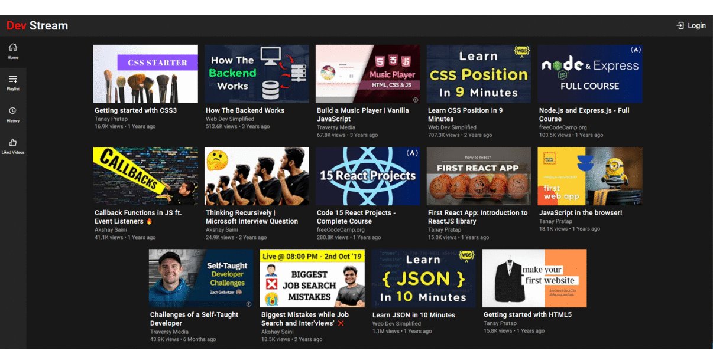

# Dev Stream

Dark themed Video library curated just for the developer community

Built with an UI resembling Youtube, the application offers users easy access to developer oriented content at one place. 

### Features

- Landing page which lists all the videos
- Video page with actions like playlist management, liking videos and with suggestion of other videos
- User Authentication
- Ability to create and manage playlists
- One place for all your liked videos
- History to keep tab of your recent visits

### Tech Stack

- React
- Express
- Mongo DB

### Installation & Usage

Clone down this repository. You will need `node` and `npm` installed globally on your machine.

`npm install`

To Run Test Suite:

`npm test`

To Start Server:

`npm start`

To Visit App:

`localhost:3000`

### Reflection

Working on this project helped me understand designing reusable components. Here I tried to build my own UI components such as loaders and Modals. 

I have used techniques like client lying for updating the like to give user least latency for simple actions.

I have utilized libraries like React Router v6, axios, react toastify in this project.

### Upcoming Features

- Comments on videos
- Channel page with videos
- Video Upload by users
- Notes taking facility
